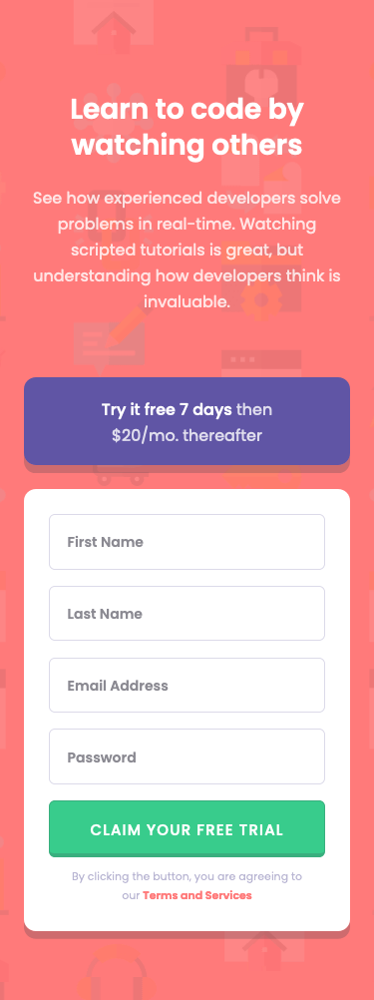
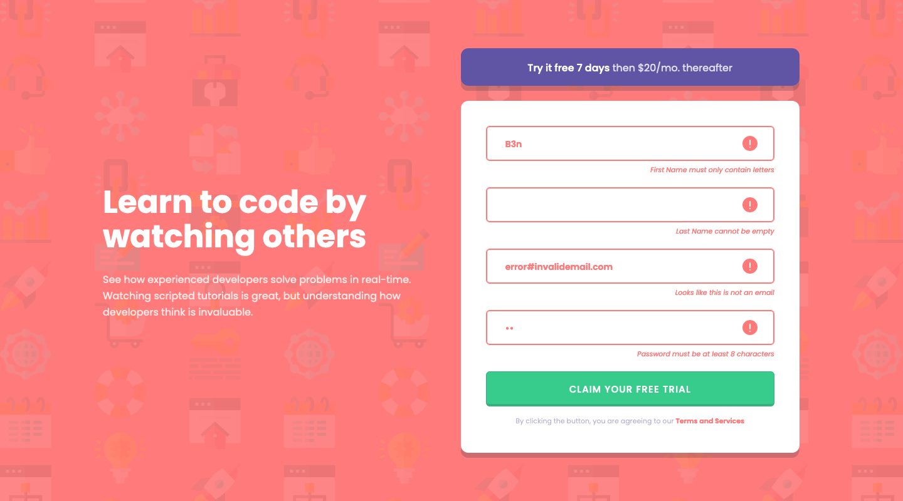

# Frontend Mentor - Intro component with sign up form solution

This is a solution to the [Intro component with sign up form challenge on Frontend Mentor](https://www.frontendmentor.io/challenges/intro-component-with-signup-form-5cf91bd49edda32581d28fd1). Frontend Mentor challenges help you improve your coding skills by building realistic projects. 

## The challenge

Users should be able to:

- View the optimal layout for the site depending on their device's screen size
- See hover states for all interactive elements on the page
- Receive an error message when the `form` is submitted if:
  - Any `input` field is empty. The message for this error should say *"[Field Name] cannot be empty"*
  - The email address is not formatted correctly (i.e. a correct email address should have this structure: `name@host.tld`). The message for this error should say *"Looks like this is not an email"*

## Screenshot

### Mobile


### Desktop



### Built with

- Semantic HTML5 markup
- CSS custom properties
- CSS Grid
- Mobile-first workflow
- JS

### What I learned

My understanding of JavaScript has improved greatly as a result of completing this project. I think my code is very concise for what it achieves.

I am particularly pleased with the way I used JavaScript to target other HTML elements in relation to the invalid input field:

```js
FORM_INPUTS.forEach( input => {
    input.addEventListener('invalid', (e) => {
       
        // Other code

        const PARENT_EL = e.target.parentElement;
        const FIELD_NAME = e.target.previousElementSibling.textContent;
        const ERROR_MESSAGE = e.target.nextElementSibling;
        
        // Other code
    });
});
```

It targets the parent to apply the 'error' styles, the previous sibling (the label which is only visible to screen readers) to get the field name (used in the error message), and the next sibling which displays the error message.


### Continued development

I am fairly good with plain CSS, but want to practise a bit more with SASS and learn to use a framework like Bootstrap, however I think I need to take on larger projects which warrant the use of these.

### Useful resources

Stack Overflow gave me the regex patterns for the different input fields.
